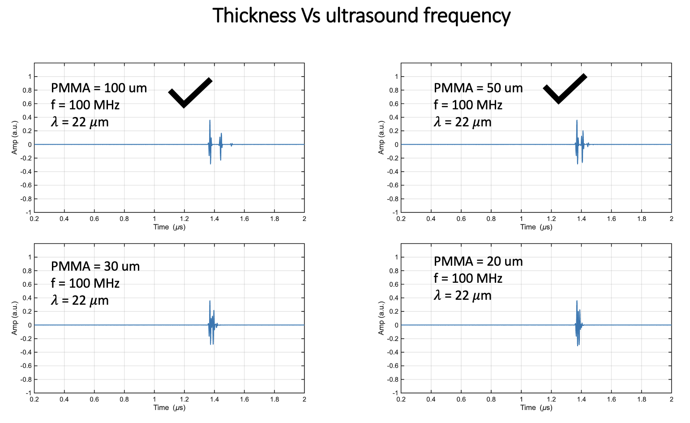
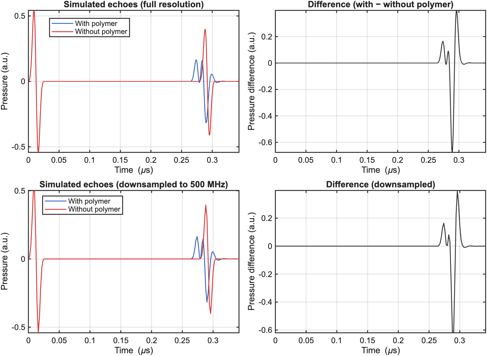
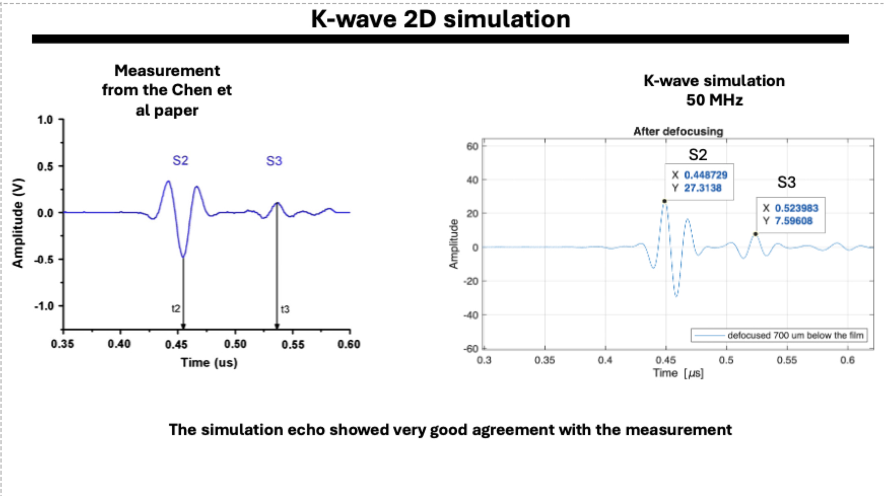
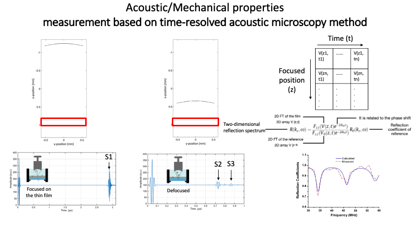

# Acoustic Simulation with k-Wave

## Simulation 1 — Time-of-Flight Limitations
The first simulation studies the limitations of measuring thin-film thickness and acoustic/mechanical properties using the ToF. It helps us understand how different acoustic impedances — arising from different polymer layers — influence the time of flight, and how this links to the ultrasound frequency.

**Script:** `Pulse_echo_Simulation_water_glass_film_glass_1.m`

   
  <em>Figure 1 — Time-of-flight simulation for a water–glass–film–glass stack.</em>

## Simulation 2 — Influence of the Polymer Film on the Reflected Echo
The second simulation focuses on the influence of the thin polymer layer on the reflected echo. The result is compared against a reference (a glass substrate) and tested across different sampling rates.

**Script:** `MultiLayerSimulation_2.m`

   
  <em>Figure 2 — Reflected echo from the polymer film compared with the glass reference.</em>

## Simulation 3 — Spring-Model Thickness Measurement
The third simulation uses a **spring model** to measure the thin polymer film with the pulse-echo method, implemented as described in the following paper:

> Dwyer-Joyce et al., *The measurement of lubricant film thickness using ultrasound*, Proc. R. Soc. Lond. A **459** (2032), 957–976.
> https://royalsocietypublishing.org/doi/10.1098/rspa.2002.1018

The k-Wave results are comparable to the original results from the paper, as shown below.

   
  <em>Figure 3 — k-Wave spring-model results compared with the reference paper.</em>

Two simulations are performed:

1. **Reference simulation** — collects the echo from the second interface of the glass.
2. **Film simulation** — collects the echo from the glass–film interface; the echo amplitude changes slightly with the thickness of the film.

The strength of this method is that it can measure a thin film using ultrasound waves in the tens-of-MHz range — but it requires the density and the sound velocity of the thin film for the calculation.

**Script:** `Kwave_simulation_with_Spring_model.m`

## Simulation 4 — Time-Resolved Acoustic Microscopy Approach
This approach relies on the geometrical defocusing of the ultrasound wave using a focused ultrasound transducer to extract both the acoustic/mechanical properties of the film and its thickness. The key advantage of this approach is that it does **not** require any prior knowledge of the film properties, which makes it ideal for tracking changes in the mechanical properties of the film.

The implementation is based on the following paper:

> *[Jian Chen, Xiaolong Bai, Keji Yang, and Bing-Feng Ju, Simultaneously measuring thickness, density, velocity and attenuation of thin layers using V(z, t) data from time-resolved acoustic microscopy, Ultrasonics, 2015, 505–511]*
> https://www.sciencedirect.com/science/article/pii/S0041624X14002832

The k-Wave simulation shows good agreement with the experimental results, as shown below.

   
  <em>Figure 4 — S2 and S3 echoes from the measurement in the paper compared with the k-Wave simulation.</em>

The animation below illustrates the defocusing approach used in time-resolved acoustic microscopy.

   
  <em>Figure 5 — Animation of the defocusing approach.</em>

**Script:** `Time_resolve_acoustic_microscopy.m` The script is still under development 

